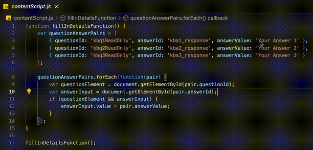
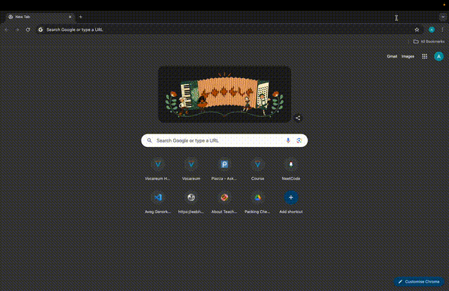

## US Visa Scheduling Website - Security Question Autofiller Extension

### Description

Simplify your US visa scheduling process with our Chrome extension! This tool auto-fills your security question answers, making your login experience quick and hassle-free.

### Setup Instructions

1. **Update `contentScript.js` File**:
   - Open the `contentScript.js` file in a text editor.
   - Locate the `answerValue` variable.
   - Update `answerValue` for each security question based on the sequence those questions were selected while creating your account.

2. **Load Unpacked Extension**:
   - Open Chrome and go to `chrome://extensions/`.
   - Enable "Developer mode" by toggling the switch in the top-right corner.
   - Click on "Load unpacked" and select the directory containing your extension files.

3. **Autofill Security Questions**:
   - As soon as you enter your ID and password on the US Visa Scheduling website, the security questions will be automatically filled with the provided answers.

### Why Choose Our Extension?

- **No Server Involved**: Your data is safe as everything runs locally on your device.
- **Easy Setup**: Simple steps to configure and use the extension.
- **Local Execution**: All processes run on your local machine, ensuring security and privacy.
- **Fast Processing**: Enjoy quick autofill responses for a seamless login experience.

Enhance your US visa scheduling process with our reliable and secure Chrome extension!

---

